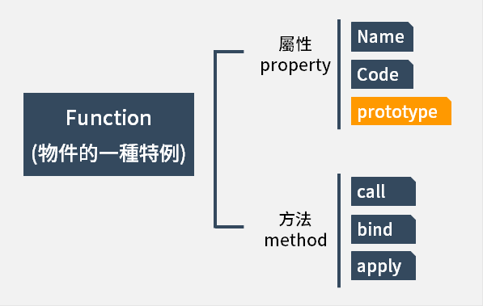
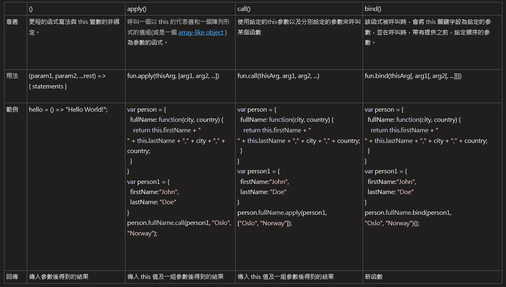

<pre>
Object -> class, new class
</pre>

```javascript
function Person (){
  this.firstName = 'John';
  this.lastName = 'Doe';
}
var john_noNew = Person();
var john_New = new Person();
console.log(john_New);
```

* class : 以上面例子， john_noNew 即為正常 function 的執行
* new class : 會呼叫 constructor 去創建出一個 john_New 的物件，故可以呼叫 constructor (使用 `new` 這個關鍵字時，實際上會先有一個空的物件被建立。)



利用 `new` 透過 function constructor 所建立的物件會繼承該 function 中 prototype 的內容，但是若沒有加入 `new` ，會不知道要執行這個程式，還是要根據這個 function 去建立object，故回傳 `undefined`，如下，如下：
```javascript
function Person() {
  this.firstName = "John";
  this.lastName = "Doe";
}

Person.prototype.getFullName = function () {
  return this.firstName + " " + this.lastName;
};

var john_New = new Person();
console.log(john_New);
// Person { firstName: 'John', lastName: 'Doe' }
console.log(john_New.getFullName());
// John Doe
console.log(john_noNew);
// undefined
console.log(john_noNew.getFullName());
//TypeError: Cannot read property 'getFullName' of undefined
```
<pre>
function invocation 差別 (), apply(), call(), bind()
</pre>


* apply() 語法和call() 幾乎一樣，最大的不同是 call() 接受一連串的參數，而 apply() 接受一組陣列形式的參數。
* this 在 Arrow function 中是被綁定的，所以套用 call 的方法時是無法修改 this